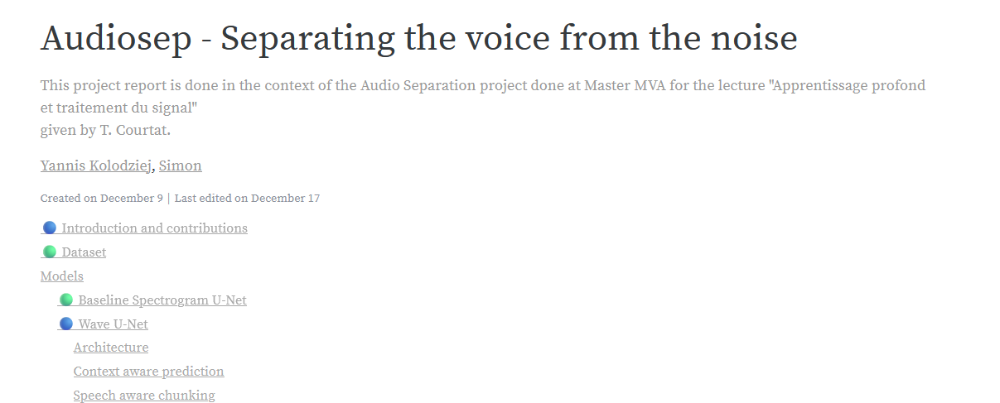

# audio-source-separation

> This project report is done in the context of the Audio Separation project
> done at Master MVA for the lecture "Apprentissage profond et traitement du
> signal"

## Quickstart

### Report

<https://api.wandb.ai/links/simon-yannis/r3do8ps3>

<a href="https://api.wandb.ai/links/simon-yannis/r3do8ps3" target="_blank">
  
</a>

[Report PDF backup](./docs/report.pdf)

<object data="./docs/report.pdf" type="application/pdf" width="700px" height="700px">
    <embed src="./docs/report.pdf">
        <p>This browser does not support PDFs. Please download the PDF to view it 
    </embed>
</object>

### Where are the Jupyter Notebooks?

We used WandB to log all our experiments, so there is no Jupyter notebook. Use
the report above to see the results and analysis (the charts are interactive,
yay!).

Because WandB reports are not that powerful, we also plotted some charts with
matplotlib, the scripts are in the [notebooks folder](./notebooks)

### Technical overview

Concerning the software stack, we relied on two software utility : Pytorch
Lightning, we can be seen as a Pytorch wrapper that helps to organize and design
reproducible ML projects. It implements for instance a Trainer class that does
all the training logic based on methods you can implement in the module class.
It has also native logging, callbacks for batch_end or test_end stages that
avoid to mix everything together. Additionally, it is made to be cross-platform
so we didn't have to adapt the code to run on GPU or CPU.

WandB, which is a standard of ML experiment tracking.

For training, at the moment we felt confident in our implementation, we used
wandb sweep for h param optimization and configured our models so that number of
layers, filters, and some other parameters related to our specific
implementations (such as $\lambda$ in wave unet) were arguments. The search of
h-params was run locally, so we add to make choices. For evaluation, we chose to
compute all the metrics on the test set and log it to wandb. Our implementation
enable to configure a testing configuration (.yaml) file and run the test. We
have one config for each model where we specified arguments such as the
checkpoint, datamodule used etc. We logged also the Audio to WandB so that we
can associate one run with the model performance.

### Reproduce

1. Get a WandB account
2. Upload the dataset to wandb using the provided script

   ```bash
   python scripts/upload_dataset_wandb.py
   ```

3. Launch a fitting run

   ```bash
   python scripts/runme.py fit configurations/fitting/wave_unet.yaml
   ```

4. Edit the configuration file in configurations/testing/waveunet.yaml` to point
   to your wandb artifact project checkpoint
5. Run a testing run

   ```bash
   python scripts/runme.py test configurations/testing/waveunet.yaml
   ```
6. (Optional) Record your voice reading a text and use scripts from `scripts/generalisation` to create the dataset. Then you can run a test on a model as explained before. 

### Hypertuning

We use WandB Sweeps to perform hyperparameter search. To launch a sweep, go to
your WandB project, create a new sweep and copy the configuration in
[configuration folder](./configurations/sweep/)
